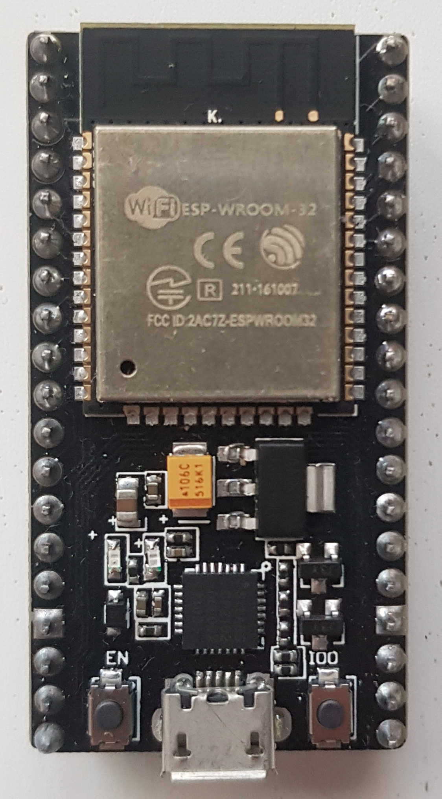
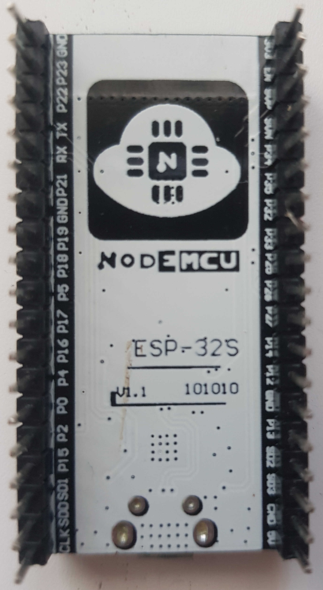

[This A on pictures]  
https://arduino.stackexchange.com/questions/83473/esp32s-v1-1-nodemcu-vs-esp32-devkitv1
https://esphome.io/devices/nodemcu_esp32.html



  
# PlatformIO
```ini
[env:nodemcu-32s]
platform = espressif32
board = nodemcu-32s
framework = arduino
```
