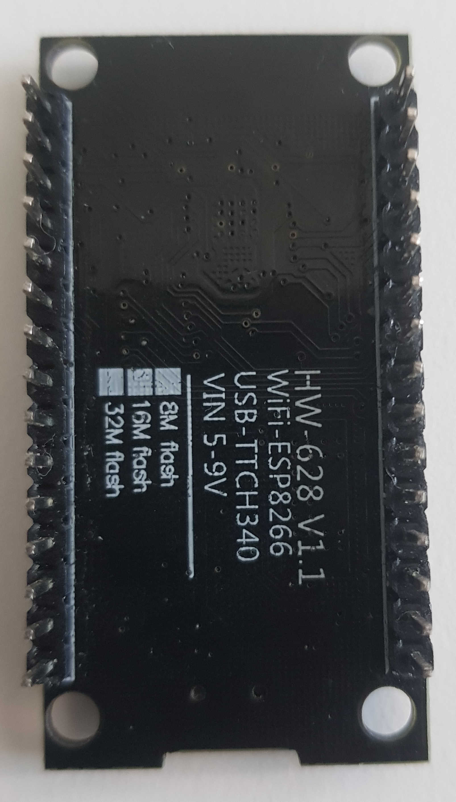
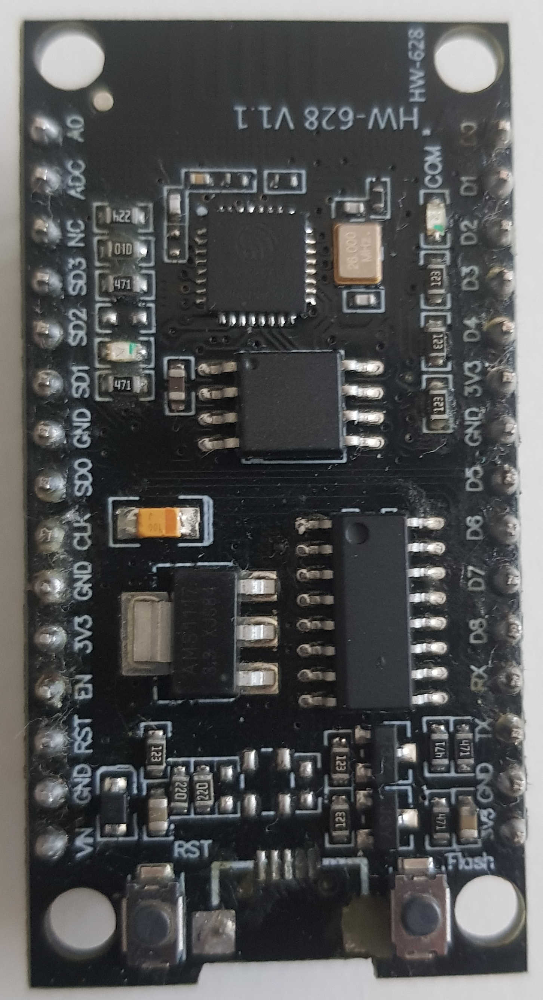

https://botland.com.pl/moduly-wifi-esp8266/10908-modul-wifi-esp8266-wemos-nodemcu-v3-32mb-11-gpio-adc-pwm-5904422300647.html




 
It should be compatible with Nodemcu v3
https://www.botnroll.com/en/esp/3558-lua-nodemcu-v3-wifi-module-esp8266-32mb-ch340g.html
https://www.teachmemicro.com/nodemcu-pinout/

# PlatformIO
```ini
[env:nodemcuv2]
platform = espressif8266
board = nodemcuv2
framework = arduino
```
