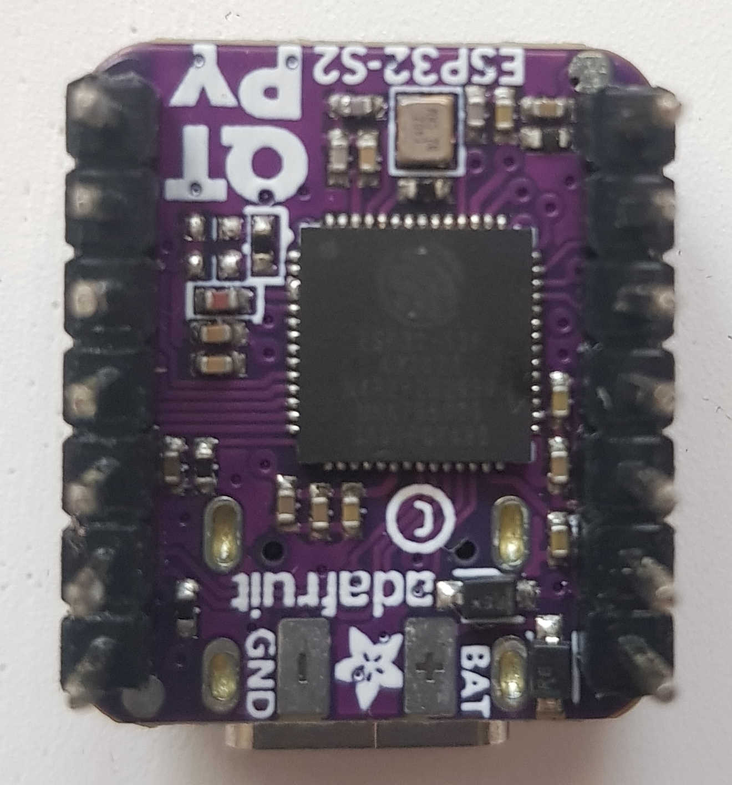
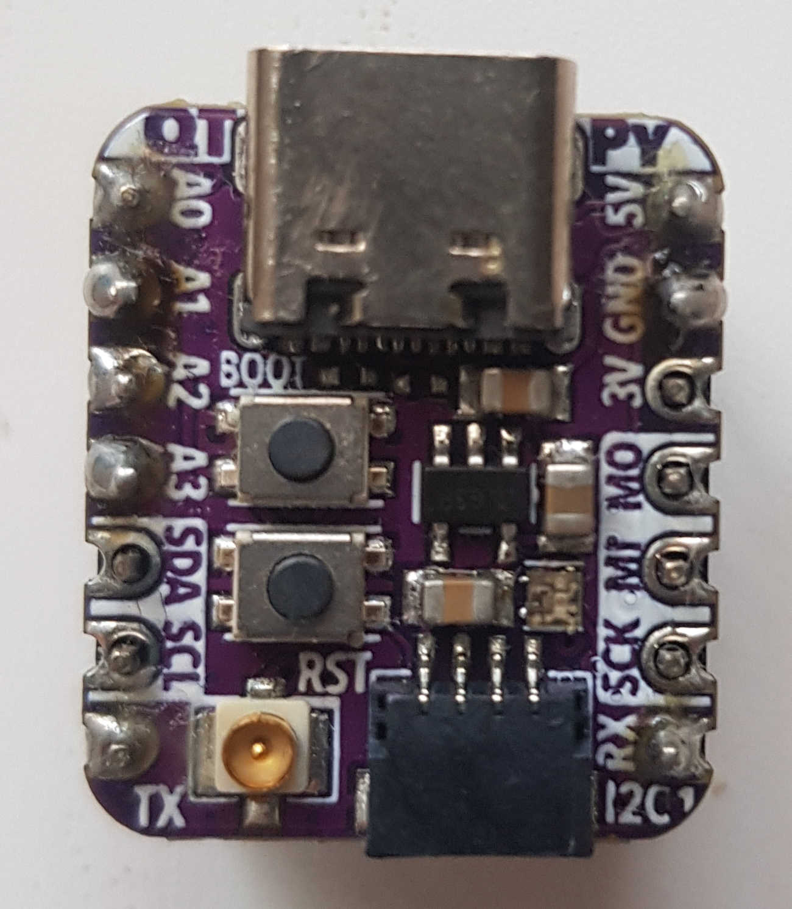

[Botland](https://botland.com.pl/moduly-wifi-i-bt-esp32/21080-qt-py-esp32-s2-plytka-rozwojowa-z-wifi-i-zlaczem-antenowym-ufl-stemma-qtqwiic-adafruit-5348.html)  
[Kamami](https://kamami.pl/en/esp32/1178261-adafruit-qt-py-esp32-s2-board-with-the-esp32-s2-wifi-module-5325.html)  
[Adafruit](https://learn.adafruit.com/adafruit-qt-py-esp32-s2)  




# PlatformIO setup

```ini
[env:qtpy-esp32-s2]
platform = 
    https://github.com/Jason2866/platform-espressif32/releases/download/v2.0.3-rc1/platform-espressif32-2.0.3-rc1.zip
board = qtpy-esp32-s2
framework = arduino
platform_packages =
    framework-arduinoespressif32 @ https://github.com/Jason2866/arduino-esp32.git
upload_speed = 921600
monitor_speed = 115200
monitor_filters = esp32_exception_decoder
build_type = debug
build_flags =
    -DCORE_DEBUG_LEVEL=5
    -DARDUINO_USB_CDC_ON_BOOT=1
    -DARDUINO_USB_MODE=0
    -DARDUINO_ADAFRUIT_QTPY_ESP32S2=1
```
