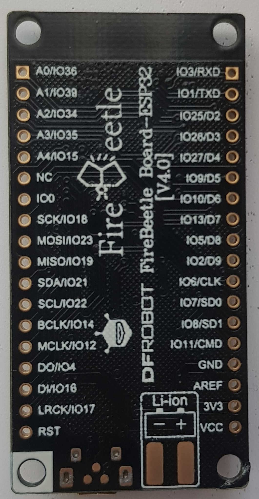
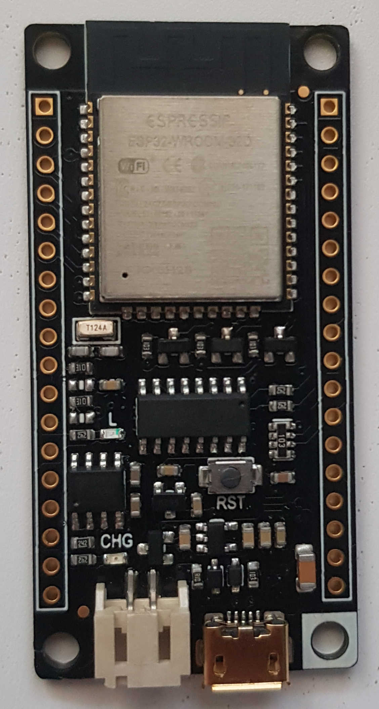

https://botland.com.pl/plytki-zgodne-z-arduino-dfrobot/9153-dfrobot-firebeetle-esp32-iot-wifi-bluetooth-5904422337612.html



  
# PlatformIO
```ini
[env:firebeetle32]
platform = espressif32
board = firebeetle32
framework = arduino
```
