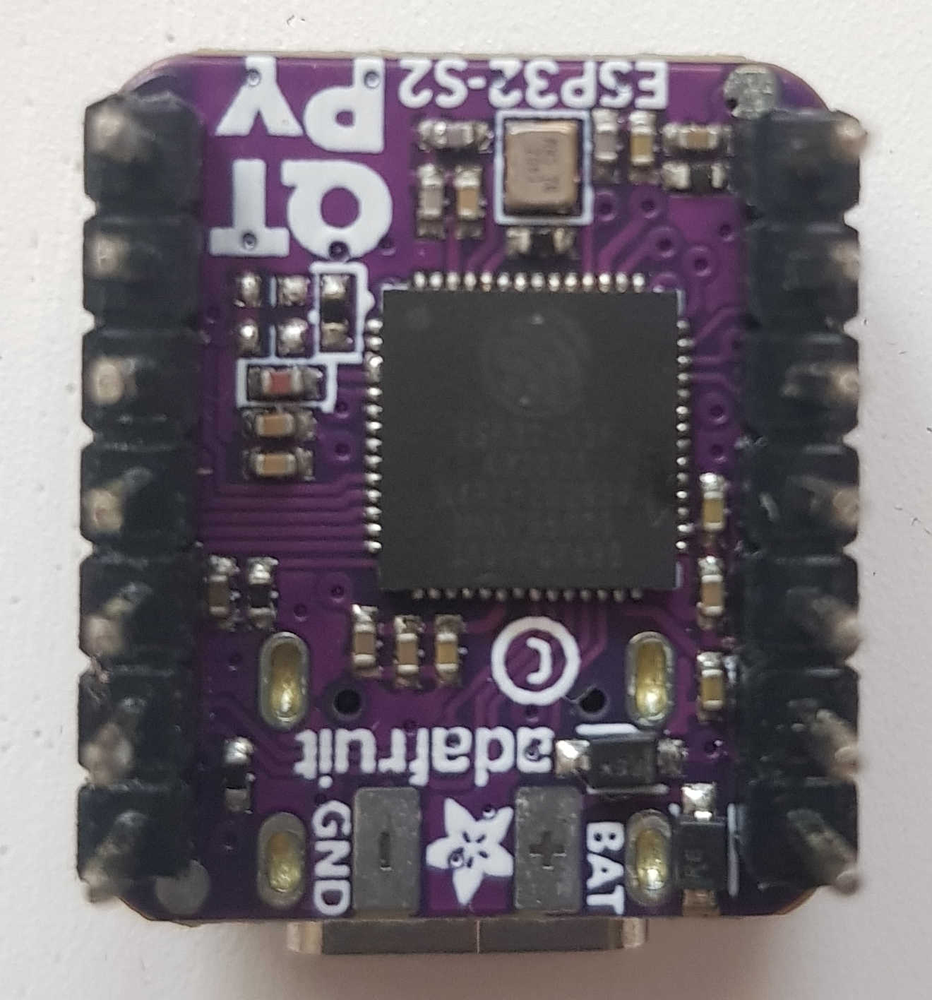
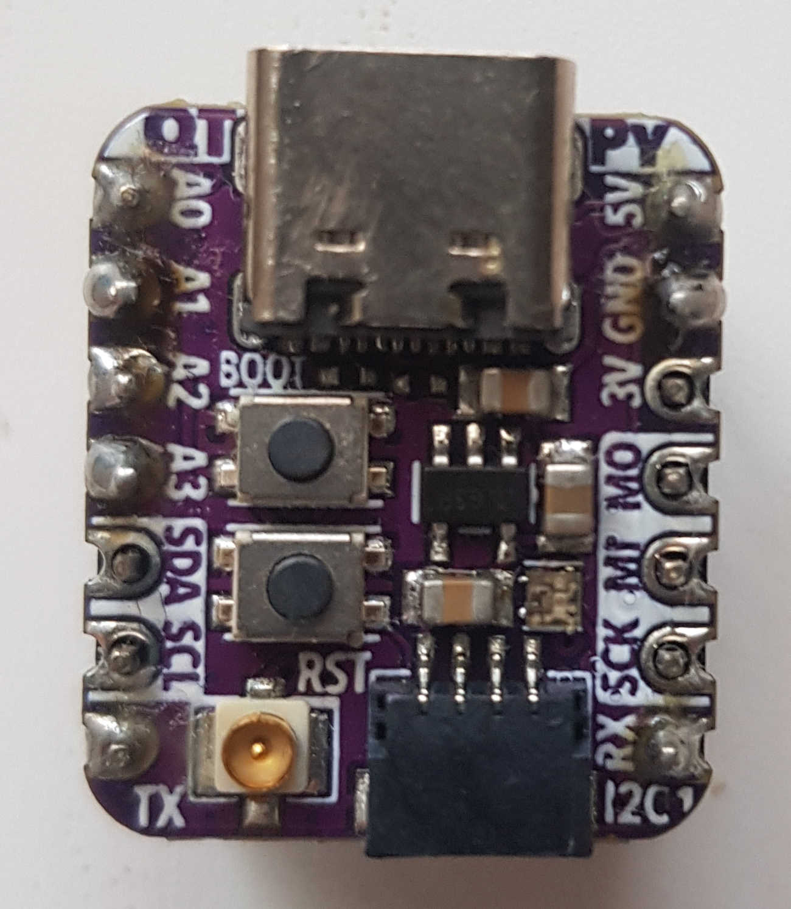

[Botland](https://botland.com.pl/moduly-wifi-i-bt-esp32/21080-qt-py-esp32-s2-plytka-rozwojowa-z-wifi-i-zlaczem-antenowym-ufl-stemma-qtqwiic-adafruit-5348.html)  
[Kamami](https://kamami.pl/en/esp32/1178784-qt-py-esp32-c3-wifi-dev-board-board-with-esp32-c3-wifi-module-5405.html)  
[Adafruit](https://learn.adafruit.com/adafruit-qt-py-esp32-c3-wifi-dev-board/pinouts)  




# PlatformIO setup

```ini
[env:adafruit_qtpy_esp32c3]
platform = espressif32
board = adafruit_qtpy_esp32c3
framework = arduino
platform_packages = 
 platformio/framework-arduinoespressif32 @ https://github.com/espressif/arduino-esp32.git
upload_speed = 921600
monitor_speed = 115200
upload_port = /dev/ttyACM0
lib_deps = 
    ...
build_flags = 
    ...
```
