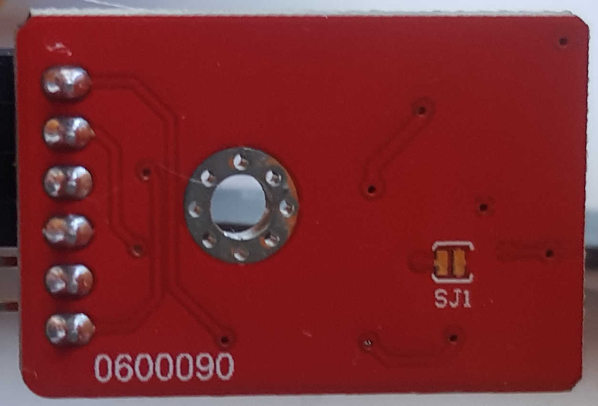
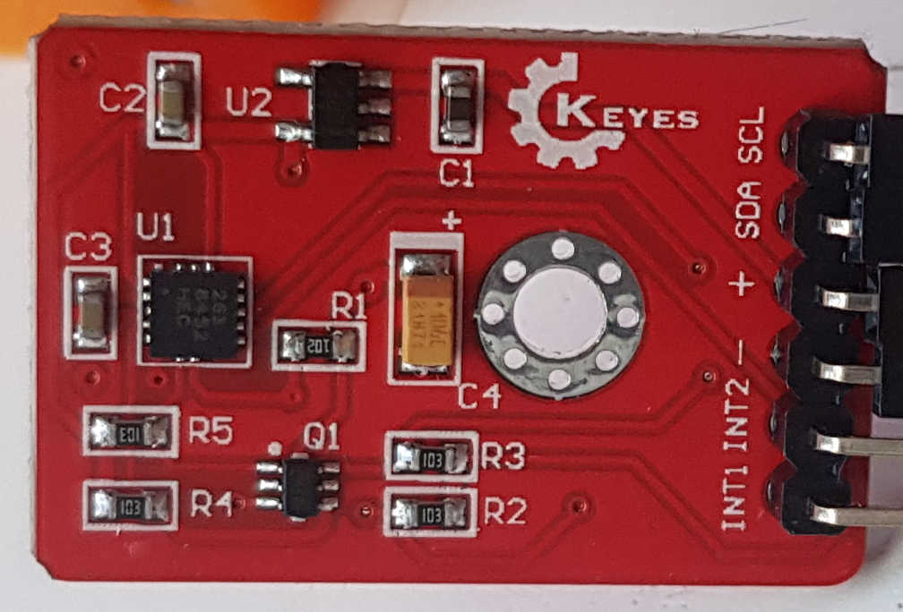

https://fluxworkshop.com/products/bdaa100039-mma8452q-3-axis-acceleration-module-keyes-red?variant=32458458890300
https://github.com/sparkfun/SparkFun_MMA8452Q_Arduino_Library



  
# Connection
Simply `sda` to `sda` and `scl` to `scl`

# PlatformIO
```ini
lib_deps = 
	sparkfun/SparkFun_MMA8452Q@^1.4.0
```

```cpp
#include "SparkFun_MMA8452Q.h"    // Click here to get the library: http://librarymanager/All#SparkFun_MMA8452Q

MMA8452Q accel;                   // create instance of the MMA8452 class

void setup(){
  Wire.begin();
  pixels.begin();
  pixels.setBrightness(50);
      if (accel.begin() == false) {
      Serial.println("Not Connected. Please check connections and read the hookup guide.");
      while (1);
  }
}
```

```cpp
 trackLoop(){
  if (accel.available()) {
    int status = get_orientation();
    if (last_status != status){
      print_orientation(status);
      show_led(status);
      sendData(status);
      
      last_status = status;
    }
    byte taped = check_tap();
    if (taped){
      Serial.println("Taped");
      rainbow();
      show_led(last_status);
      sendData(16);
    }
  }
  last_time = millis();
}
```

```cpp
int get_orientation(){
    if (accel.isRight() == true)
      return 1;
    else if (accel.isLeft() == true)
      return 2;
    else if (accel.isUp() == true)
      return 3;
    else if (accel.isDown() == true)
      return 4;
    else if (accel.isFlat() == true && accel.getCalculatedZ() > 0)
        return 5;
    else if (accel.isFlat() == true && accel.getCalculatedZ() <= 0)
        return 6;
    return 0;
}

byte check_tap(){
    byte status = accel.readTap();
    byte calculated = status & 1<<3;
    return calculated;
}
```
